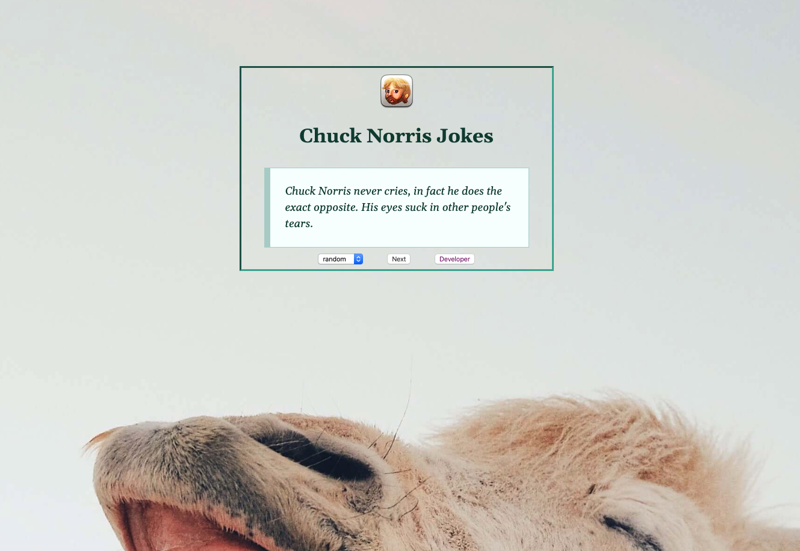

# Chuck Norris Jokes

## Problem

> This app is to generate random Chuck Norris Jokes.
> This app uses an API (https://api.chucknorris.io).

#### Technology Used

> React, JavaScript, CSS, NPM, REST API
> [Check out Chuck Norris Jokes](https://chuck-norris-jokes-michael-anokye.netlify.app/ "Link to Chuck Norris Jokes").

## Home Screen

> Chuck Norris Jokes welcomes you with a home screen where you get a random joke.
> You can also choose a category of jokes.
> 

## Video Demo

> Below is a video demo of how Chuck Norris Jokes works.
> 
